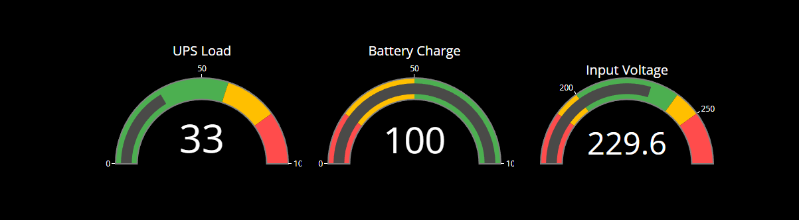

# Lyonn UPS Telegram Bot

[](https://t.me/Lyonn_UPS_bot) [](https://www.python.org) [](https://www.sqlite.org) [](https://networkupstools.org) [](https://www.proxmox.com) [](https://github.com/juanchixd/Bot_ups_Lyonn) [](https://fastapi.tiangolo.com)

      

## Table of Contents

- [Lyonn UPS Telegram Bot](#lyonn-ups-telegram-bot)
  - [Table of Contents](#table-of-contents)
  - [Introduction](#introduction)
  - [Demo](#demo)
  - [Screenshots](#screenshots)
  - [Features](#features)
  - [Development](#development)
    - [Proxmox](#proxmox)
      - [Create LXC container, install Debian and configure usb passthrough](#create-lxc-container-install-debian-and-configure-usb-passthrough)
    - [General steps](#general-steps)
      - [Install NUT package](#install-nut-package)
      - [Configure NUT](#configure-nut)
    - [Python](#python)
      - [Install the required packages](#install-the-required-packages)
      - [Run the bot in the background](#run-the-bot-in-the-background)
      - [API](#api)
  - [References](#references)
  - [Contributing](#contributing)
  - [Author](#author)
  - [Gratitudes](#gratitudes)
  - [License](#license)

## Introduction


This is a telegram bot that sends a message to a telegram chat when the power goes out and when it comes back on. In turn, it also stores information about the status, voltage, among other parameters, to have a history and to make analysis or graphs with them. It uses the Network UPS Tools (NUT) to monitor the UPS and send the messages.

The bot is written in Python and uses the pyTelegramBotAPI library to interact with the Telegram API. The NUT is used to monitor the UPS and send the messages to the bot. The data is stored in a SQLite database.

In turn, implements a graphic that shows the voltage of the UPS over time. This graphic is generated using the matplotlib library. I also implemented and API that returns the data in JSON format. This API can be used to create a custom frontend to display the data. The frontend can be a web page, a mobile app, or any other type of application that can consume an API. The API is implemented using the FastAPI library.

This project is based on the [Network UPS Tools](https://networkupstools.org) software, which is a collection of programs that provide a common interface for monitoring and administering UPS hardware. The software is compatible with a wide range of UPS devices and is available for many operating systems.

The bot is running in a Proxmox container with Debian installed. The UPS is connected to the host and is passed through to the container. The bot is running in the container and is monitoring the UPS using NUT.

This idea is based on a project that I found on the internet, but I made some changes to adapt it to my needs. The original project is [here](https://github.com/juanstdio/UPS_TelegramBot/tree/main) created by [Juan Blanc](https://github.com/juanstdio).

I also implemented a backup database in supabase, in another project I use this database to show the data in a web page [here](https://github.com/juanchixd/UPS_Lyonn_web).

## Demo

You can test the bot by sending a message to the [Lyonn UPS Telegram Bot](https://t.me/Lyonn_UPS_bot) on Telegram.

And you can test the API by going to `http://api.juangonzalez.com.ar/docs` where you can see the documentation of the API and the example of the data.

## Screenshots


Graphic


API gauges



## Features

- Send a message to a telegram chat when the power goes out and when it comes back on.
- Store information about the status, voltage, among other parameters, to have a history and to make analysis or graphs with them.
- Use the Network UPS Tools (NUT) to monitor the UPS and send the messages.
- Written in Python and uses the pyTelegramBotAPI library to interact with the Telegram API.
- The data is stored in a SQLite database.
- Implements a graphic that shows the voltage of the UPS over time.
- Implements an API that returns the data in JSON format.
- Implements backup database in supabase (in other project i use this database to show the data in a web page [here](https://github.com/juanchixd/UPS_Lyonn_web)).

## Development

In this case, I'm going to mount all this in a proxmox container, so I'm going to explain steps that are specific to proxmox that can be skipped if you have a direct debian installation.

### Proxmox

#### Create LXC container, install Debian and configure usb passthrough

First, we need to create a new LXC container in proxmox. To do this, we need to go to the proxmox web interface and create a new container. We need to select the template "Debian 12" and configure the container as we want. We need to make sure that the container has internet access.

After that, we need to configure the USB passthrough to the container. To do this, we need to identify the USB device that we want to pass through to the container. We can do this by running the following command in the proxmox host:

```bash
lsusb
```

In my case the UPS is connected to the host and the output of the command is:

```bash
Bus 005 Device 006: ID XXXX:XXXX Cypress Semiconductor USB to Serial
```

After that, select the container in the proxmox web interface and go to the "Resources" tab. Click on "Add" and select "Device Passthrough". In the "Device Path" field, we need to add the USB device that we want to pass through to the container. In my case, the device is `/dev/bus/usb/005/006`. After that, click on "Add" and "Start" the container.

Next, verify that the UPS is detected by Debian. To do this, run the following command:

```bash
lsusb
```

The output should be something like this:

```bash
Bus 005 Device 006: ID XXXX:XXXX Cypress Semiconductor USB to Serial
```

### General steps

#### Install NUT package

Install the NUT package in the proxmox container. To do this, we need to add the NUT repository to the sources list and install the package.

```bash
apt update
apt install nut
```

Next, verify that the UPS is detected by NUT. To do this, run the following command:

```bash
nut-scanner
```

The output should be something like this:

```bash
Scanning USB bus.
No start IP, skipping NUT bus (old connect method)
Scanning NUT bus (avahi method).
Failed to create client: Daemon not running
[nutdev1]
        driver = "nutdrv_qx"
        port = "auto"
        vendorid = "XXXX"
        productid = "XXXX"
        product = "USB to Serial"
        vendor = "INNO TECH"
        bus = "005"
```

In this case, the UPS is detected by NUT and the driver is `nutdrv_qx`.

#### Configure NUT

Setup the configuration files. First, we need to edit the `/etc/nut/nut.conf` file and add the following lines:

```bash
MODE=standalone
```

Next, we need to configure NUT to monitor the UPS. To do this, we need to edit the `/etc/nut/ups.conf` file and add the following lines:

```bash
[ups]
        driver = nutdrv_qx
        port = auto
        bus = 005
        vendorid = XXXX
        productid = XXXX
        product = "USB to Serial"
        vendor = "INNO TECH"
        desc = "UPS"
```

Save the changes and run this command to check the configuration:

```bash
upsdrvctl start
```

Maybe you will see this error:

```bash
Network UPS Tools - Generic Q* USB/Serial driver 0.32 (2.8.0)
USB communication driver (libusb 1.0) 0.43
addchar: discarding invalid character (0x0a)!
libusb1: Could not open any HID devices: insufficient permissions on everything
No supported devices found. Please check your device availability with 'lsusb'
and make sure you have an up-to-date version of NUT. If this does not help,
try running the driver with at least 'subdriver', 'vendorid' and 'productid'
options specified. Please refer to the man page for details about these options
(man 8 nutdrv_qx).

Driver failed to start (exit status=1)
```

I found the solution in a post on the proxmox forum, is adding nut to the root group. To do this, run the following command:

```bash
adduser nut root
```

> [!NOTE]
> Thanks to heywhatsupo1235 for [this post](https://forum.proxmox.com/threads/network-ups-tools-nut-as-ubuntu-22-04-lxc-container.152248/)

After that, run the command again:

```bash
upsdrvctl start
```

The output should be something like this:

```bash
Network UPS Tools - UPS driver controller 2.8.0
Network UPS Tools - Generic Q* USB/Serial driver 0.32 (2.8.0)
USB communication driver (libusb 1.0) 0.43
Using protocol: Voltronic-QS 0.07
```

Next, we need to edit the `/etc/nut/upsd.conf` file and add the following lines:

```bash
LISTEN localhost 3493
```

Next, we need to edit the `/etc/nut/upsmon.conf` file and add the following lines:

```bash
MONITOR ups@localhost 1 monuser secret master
```

Next, we need to edit the `/etc/nut/upsd.users` file and add the following lines:

```bash
[monuser]
        password = secret
        actions = SET
        instcmds = ALL
```

Save the changes and restart the NUT service:

```bash
systemctl restart nut-server
```

### Python

#### Install the required packages

Copy the repository to the proxmox container and navigate to the directory where the repository is located.

```bash
git clone https://github.com/juanchixd/Bot_ups_Lyonn.git
cd Bot_ups_Lyonn
```

Install the required packages:

```bash
apt install python3 python3-pip
```

I recommend using a virtual environment to install the required Python packages. To do this, run the following commands:

```bash
python3 -m venv venv
source venv/bin/activate
```

Install the packages in requirements.txt:

```bash
pip install -r requirements.txt
```

Configure the bot by editing the .env_example file and adding the required values. After that, rename the file to .env:

```bash
mv .env_example .env
```

In the .env file, change the following lines
  
```bash
TOKEN= YOUR_TELEGRAM_BOT_TOKEN
CHAT_ID= YOUR_TELEGRAM_CHAT_ID
SUPABASE = TRUE or FALSE
SUPABASE_URL= YOUR_SUPABASE_URL
SUPABASE_KEY= YOUR_SUPABASE_KEY
```

The SUPABASE_URL and SUPABASE_KEY are optional, if you want to use the supabase database, you need to change the SUPABASE to TRUE and add the URL and the KEY.

Finally, run the bot:

```bash
python main.py
```

#### Run the bot in the background

To run the bot in the background, we can use services. First, we need to create a service file. To do this, run the following command:

```bash
nano /etc/systemd/system/lyonn_ups_bot.service
```

Add the following lines to the file:

```bash
[Unit]
Description=Lyonn UPS Telegram Bot
After=network.target

[Service]
User=root
WorkingDirectory=/path/to/Bot_ups_Lyonn
ExecStart=/path/to/Bot_ups_Lyonn/venv/bin/python /path/to/Bot_ups_Lyonn/main.py
Restart=always

[Install]
WantedBy=multi-user.target
```

Save the changes and run the following commands:

```bash
systemctl daemon-reload
systemctl enable lyonn_ups_bot
systemctl start lyonn_ups_bot
```

The bot should now be running in the background.

#### API

The API is implemented using the FastAPI library, which is already running in the background. To access the API, open a web browser and go to `http://xxx.xxx.xxx.xxx:5005/` where `xxx.xxx.xxx.xxx` is the IP address of the proxmox container. You should see a page with the message "Hello, World!".

To access the data, go to `http://xxx.xxx.xxx.xxx:5005/api/last_ups_data`, you should see a JSON response with the data. Example:
  
```json
{
"timestamp":"2024-08-15 19:10:50",
"battery_charge":100.0,
"battery_voltage":13.6,
"input_voltage":235.2,
"output_voltage":235.2,
"ups_load":27.0,
"ups_status":"OL"
}
```

You can also access the API documentation by going to `http://xxx.xxx.xxx.xxx:5005/docs`. You should see a page with the documentation of the API.

And that's it! The bot and the API are now running in the proxmox container and you can access them from a web browser.

Any questions, you can contact me on [Telegram](https://t.me/Juanbgon)

## References

- [Network UPS Tools](https://networkupstools.org)
- [Proxmox](https://www.proxmox.com)
- [pyTelegramBotAPI](https://github.com/eternnoir/pyTelegramBotAPI)
- [SQLite](https://www.sqlite.org)
- [Python](https://www.python.org)
- [FastAPI](https://fastapi.tiangolo.com)
- [Supabase](https://supabase.io)
- <https://forum.proxmox.com/threads/network-ups-tools-nut-as-ubuntu-22-04-lxc-container.152248/>
- <https://www.kreaweb.be/diy-home-server-2021-software-proxmox-ups/#a_Create_LXC_container>

## Contributing

Pull requests are welcome. For major changes, please open an issue first to discuss what you would like to change.

Please make sure to update tests as appropriate.

## Author

- **Juan Gonzalez** - _Initial work_ - [juanchixd](https://github.com/juanchixd)

## Gratitudes

- **heywhatsupo1235** - _For the solution to the NUT problem in proxmox_ - [heywhatsupo1235](https://forum.proxmox.com/threads/network-ups-tools-nut-as-ubuntu-22-04-lxc-container.152248/)
- **eternnoir** - _For the pyTelegramBotAPI library_ - [eternnoir](https://github.com/eternnoir/pyTelegramBotAPI)
- **Kreaweb** - _For the Proxmox tutorial_ - [Kreaweb](https://www.kreaweb.be/diy-home-server-2021-software-proxmox-ups/#a_Create_LXC_container)
- **Network UPS Tools** - _For the NUT software_ - [Network UPS Tools](https://networkupstools.org)
- **FastAPI** - _For the FastAPI library_ - [FastAPI](https://fastapi.tiangolo.com)
- **Supabase** - _For the supabase database_ - [Supabase](https://supabase.io)
- **Juan Blanc** & **Eze Fernandez** - _For the help with the development_ - [Juan Blanc](https://github.com/juanstdio) - [Eze Fernandez](https://github.com/ezefernandez93)

## License

This project is licensed under the Apache License 2.0 - see the [LICENSE](LICENSE) file for details.

```python
# Lyonn UPS Telegram Bot - Developed by Juan Gonzalez with the helf of Juan Blanc and Eze Fernandez - © 2024
```
